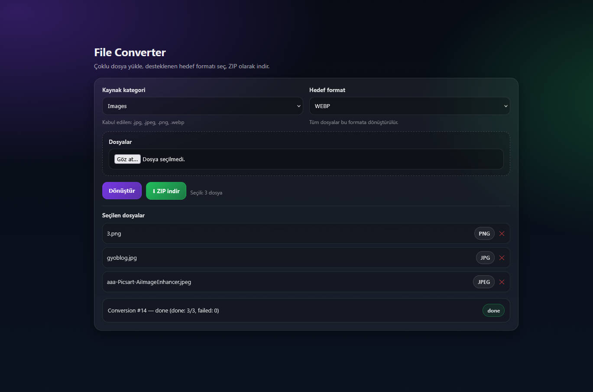

# File Converter (Laravel + Docker)


Category-based multi-file converter built with Laravel, Docker and asynchronous queue workers.

---

## Preview

<p align="center">
  
</p>

Screenshot located in `/screenshots` directory.

---

## Overview

This application allows users to:

- Upload multiple files simultaneously
- Select a source category (Image or Document)
- Convert uploaded files into a selected target format
- Download all converted files as a ZIP archive

All conversion processes run asynchronously using Laravel Queue workers inside Docker containers.

---

## Features

### Category-Based Conversion

Instead of selecting individual file extensions, users select a file category.

#### Image Files

Accepted formats:

- jpg
- jpeg
- png
- webp

Target formats:

- jpg
- png
- webp

Same-format conversions are automatically prevented.

#### Document Files

Accepted formats:

- docx
- xlsx
- pptx

Target formats:

- pdf
- html
- txt

Mixed uploads are supported (e.g. png + webp together).

---

## Architecture

- Laravel 10+
- Docker & Docker Compose
- MySQL (containerized)
- Laravel Queue Workers (async processing)
- LibreOffice Headless (document conversion)
- Imagick (image conversion)
- Alpine.js frontend
- Automatic ZIP batch export

All file processing occurs inside isolated Docker containers.

LibreOffice and Imagick are preinstalled in the Docker environment.

---

## Installation

### 1. Clone repository

```bash
git clone https://github.com/ArdaRecep/file-converter.git
cd file-converter
```

---

### 2. Start Docker environment

```bash
docker compose up -d --build
```

---

### 3. Laravel setup

Enter container:

```bash
docker exec -it file-converter-app bash
```

Install dependencies and configure environment:

```bash
composer install
cp .env.example .env
php artisan key:generate
php artisan migrate
php artisan storage:link
```

Important:

```
DB_HOST=db
```

must be set inside `.env` when running via Docker.

---

### 4. Start queue worker

Run queue worker in a separate terminal:

```bash
docker exec -it file-converter-app php artisan queue:work
```

---

## How It Works

1. User selects conversion category (Image or Document)
2. Multiple files can be uploaded at once
3. Backend validates extensions based on category
4. Each file is dispatched to a Laravel queue job
5. Converted outputs are stored in:

```
storage/app/conversions/{conversion_id}/output
```

6. Results are compressed into a ZIP archive and provided for download.

---

## Technical Highlights

- Category-driven conversion architecture
- Mixed file upload support
- Dockerized LibreOffice headless conversion
- Background processing with Laravel Queue
- Imagick-based image conversion and optimization
- Automatic ZIP packaging of results
- Clean separation between controller and job logic

---

## Future Improvements

- PDF → Image conversion
- Drag & drop upload UI
- Conversion progress bar improvements
- Cloud storage integration (AWS S3 etc.)
- Authentication system
- Rate limiting & job prioritization
- Automatic format detection from uploaded files

---

## License

MIT